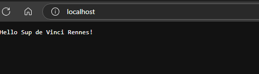
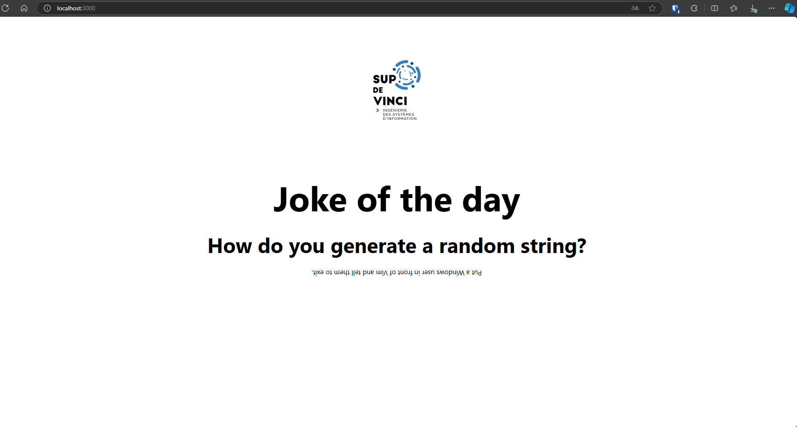

# Sup de Vinci - Projet du module Containers

*Testé avec `rust v1.82.0` et `node 23.0.0`.*
## Lien Docker Hub

- https://hub.docker.com/repositories/svenathanase

## Cloner le projet

Commencez par cloner le dépôt du projet en utilisant la commande suivante :

```bash
git clone https://github.com/SvenAthSDV/sdv-containers-project.git
```

Ce rendre dans le dossier
```bash
cd sdv-containers-project
```

#### Utilisation de Docker

Pour exécuter l'API dans un environnement Docker pour le développement :

1. Assurez-vous que Docker est installé et en cours d'exécution sur votre machine.
2. Exécutez la commande suivante pour démarrer le service API :
   ```bash
   docker-compose up --build
   ```

#### Afficher les pages web

Se rendre sur :
- http://localhost:80



- http://localhost:3000


Ce pipeline CI/CD est configuré pour construire et pousser des images Docker pour une API et un front-end en environnement de développement sur Docker Hub. Il utilise GitHub Actions pour automatiser le processus de build et de push lorsque du code est poussé sur la branche `main` ou qu'une pull request y est créée.


## La CI/CD
#### Déclencheurs du Workflow

```yaml
on:
  push:
    branches:
      - main
  pull_request:
    branches:
      - main
```
Le workflow se declenche lors d'un push sur la branche main 

#### Checkout code
```yaml
- name: Checkout code
  uses: actions/checkout@v3
```
Cette étape récupère le code source du dépôt pour que les fichiers soient disponibles pour le build

#### Connexion Docker HUB
```yaml
- name: Log in to Docker Hub (First Repo)
  uses: docker/login-action@v2
  with:
    username: ${{ secrets.DOCKER_USERNAME }}
    password: ${{ secrets.DOCKER_PASSWORD }}
```
Se connecte au dépôt Docker Hub en utilisant des secrets (DOCKER_USERNAME et DOCKER_PASSWORD)

#### Build des images
```yaml
- name: Build API Dev Image
  run: docker build -f sdv-api/Dockerfile -t myapp-api-dev:latest ./sdv-api
- name: Build Web Dev Image
  run: docker build -f sdv-web/Dockerfile -t myapp-web-dev:latest ./sdv-web
```
Construction des images en utilisant les Dockerfiles

#### Push sur Docker Hub
```yaml
- name: Tag and Push API Dev Image to First Repo
  run: |
    docker tag myapp-api-dev:latest ${{ secrets.DOCKER_USERNAME }}/sdv-api-dev:latest
    docker push ${{ secrets.DOCKER_USERNAME_1 }}/sdv-api-dev:latest
- name: Tag and Push Web Dev Image to First Repo
  run: |
    docker tag myapp-web-dev:latest ${{ secrets.DOCKER_USERNAME }}/sdv-web-dev:latest
    docker push ${{ secrets.DOCKER_USERNAME }}/sdv-web-dev:latest
```
Tag des images API et WEB avec le nom du dépôt Docker Hub, puis la pousse.

#### Image Docker Hub 
https://hub.docker.com/repositories/svenathanase

## État de la Stack et Mise en Place de la CI/CD
Lors de la mise en place initiale de la stack, tout fonctionnait correctement (voir capture d'écran ci-dessus pour référence). Cependant, en configurant la CI/CD sur un autre PC, des dysfonctionnements ont été constatés dans la stack. 
J'ai donc privilégié la CI/CD au debug 
